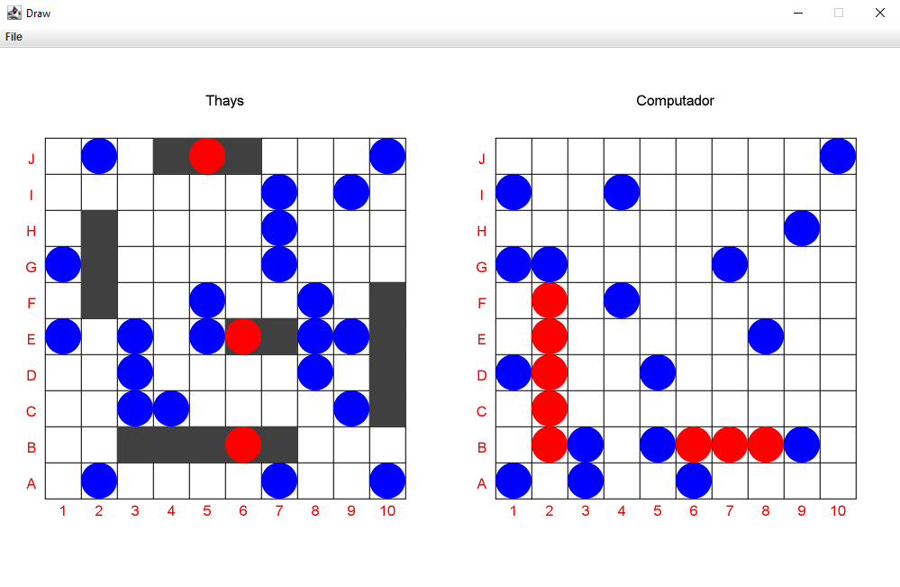
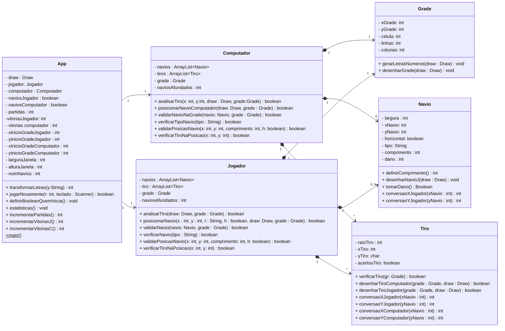

#  Batalha Naval 💣🚢

### Como Jogar 🤔
- **Disposição dos navios do jogador:** 🚤
    - Digite a coordenada (x,y) do mapa em que deseja posicionar seu navio
    - Indique a posição do navio vertical (0) ou horizontal (1)
      - Navios são desenhados da origem para cima ou da origem para a direita
    - Selecione qual tipo de navio deseja adicionar ao tabuleiro
        - Porta-Aviões(P), Enouraçado(E), Submarino(S), Cruzador(C) e Contratorpedeiro(N) 
        - Tamanhos: (P) 5 casas, (E) 4 casas, (S) 3 casas, (C) 3 casas e (N) 2 casas

- **Atirar:** 🔫
    - Digite a coordenada (x,y) do mapa em que deseja atirar da grade inimiga
      - Círcuclos azuis significam que o disparo acertou a água
      - Círculos vermelhos indicam que o disparo acertou uma posição do navio inimigo
    

- **Fim da partida:** 💯
  - Se todas as posições de um navio forem acertadas, o navio é eliminado
    - Vence aquele que destruir todos os 5 navios do adversário primeiro
  - Você pode iniciar uma nova partida digitando 1 ou fechar o jogo digitando 0
  - Ao encerrar o jogo as estatísticas serão mostradas no terminal

 ____   

### Captura de Tela do Jogo 📸

 ____  
### Implementações

- ✔️
  - Desenhar os navios com o Scanner
  - Navio não ultrapassar a grade/sobrepor outros
  - Verificar se a posição da grade já está ocupada
  - Atirar 
  - Contar dano do navio
  - Mensagem de quem é o vencedor
  - Loop no menu para o jogo
  - Estatísticas
  - Alterar a ordem do primeiro a jogar

- ❌
  - Mensagem de navio afundado/local do tiro

 ____
### UML 📄

